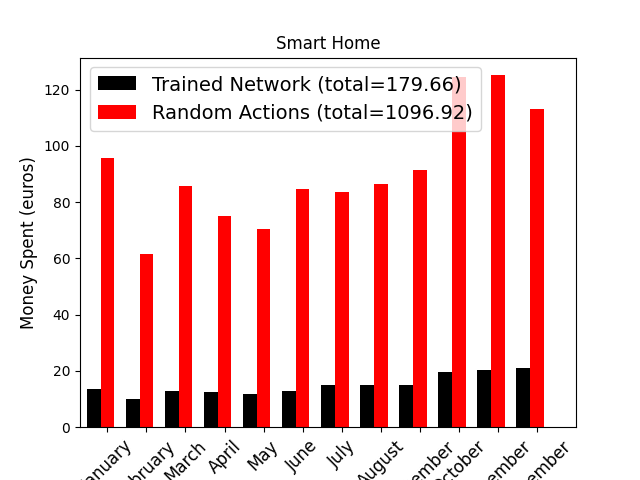
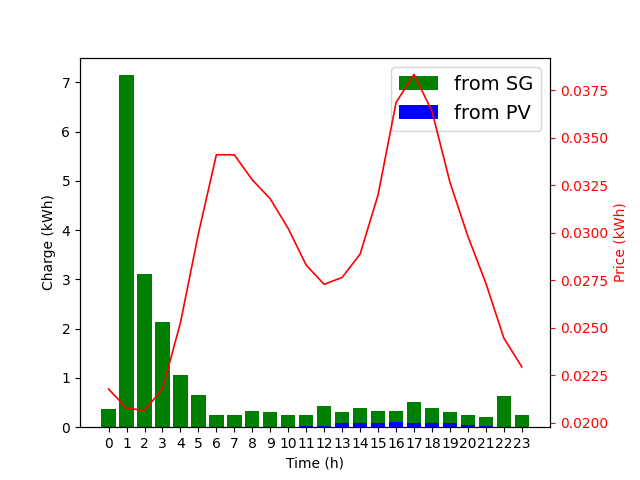
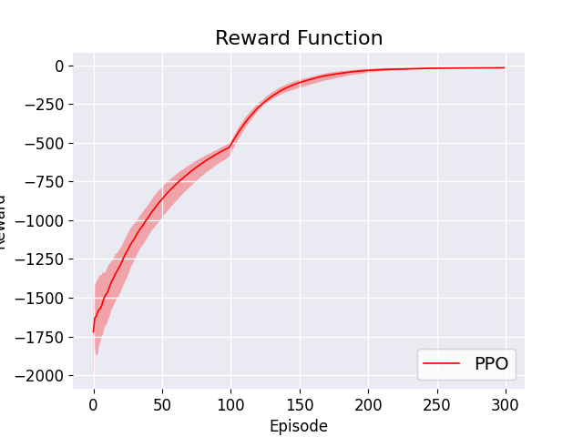

# Home Energy Management Model.
This file provides instructions to run the model.

# Description
This model is an implementation of Deep Q learning for the purpose of Home Energy Management.

# Requirements
### Python
You need Python to run the model.

In Ubuntu, Mint and Debian you can install Python 3 like this:
```bash
$ sudo apt-get install python3 python3-pip
```

### Dependencies
Some of the dependencies required to run the code, and some info about the environment (e.g., reward, actions, etc.).

 - tensorflow (>= 2.3)
 - numpy
 - Pandas
 - matplotlib

Use the package manager [pip](https://pip.pypa.io/en/stable/) to install them.

```bash
C:\Project_PATH>pip install tensorflow
C:\Project_PATH>pip install numpy
C:\Project_PATH>pip install Pandas
C:\Project_PATH>pip install matplotlib
```

## Usage
There are 3 simple command line interface to run the code for training, testing and ploting:

### - Train a new model (this will save the model only at the end of the training):
```python
C:\Project_PATH>python main.py -train_model <number_of_Episodes>
```
_`note that`_ **300 Episodes** _`should be enough`_.


### - Test a trained model (I've already provided a trained model in the "trained_models" folder)
```python
C:\Project_PATH>python main.py -test_model
```


### - Data plotting of the trained model:
You can plot one of the graphs: "money_spent", "battery_charge", "reward_function"

#### 1- Output ( Money spent):
```python
C:\Project_PATH>python main.py -plot_graph money_spent
```



#### 2- Output ( Battery charge):
```python
C:\Project_PATH>python main.py -plot_graph battery_charge
```



#### 3- Output ( Reward function):
```python
C:\Project_PATH>python main.py -plot_graph reward_function
```



## License
