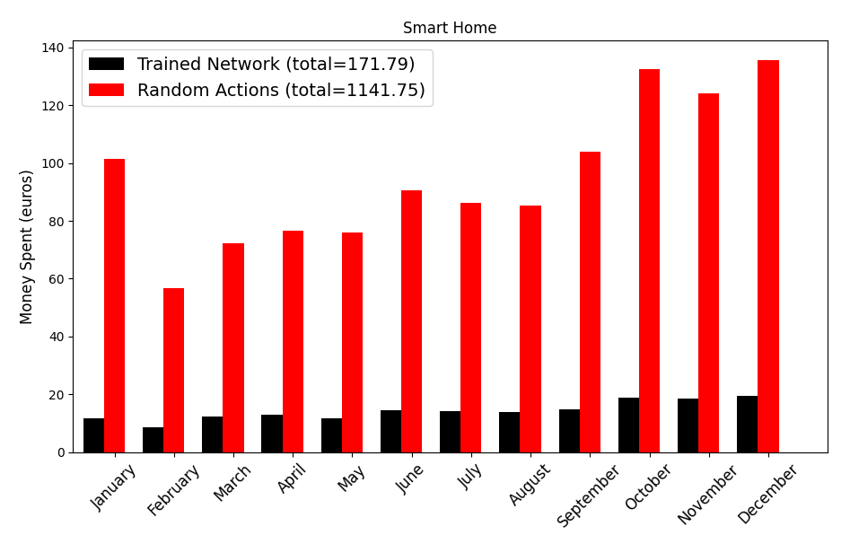
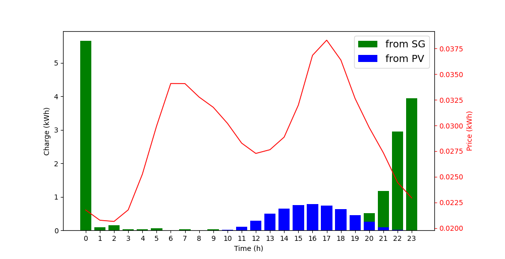
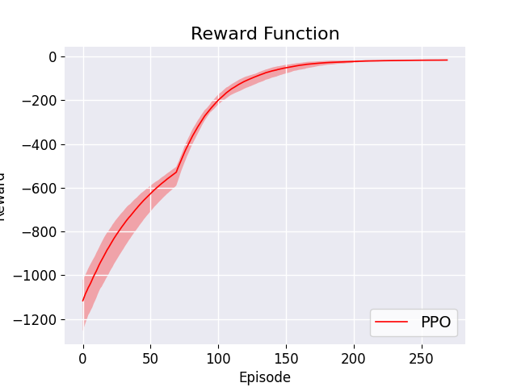
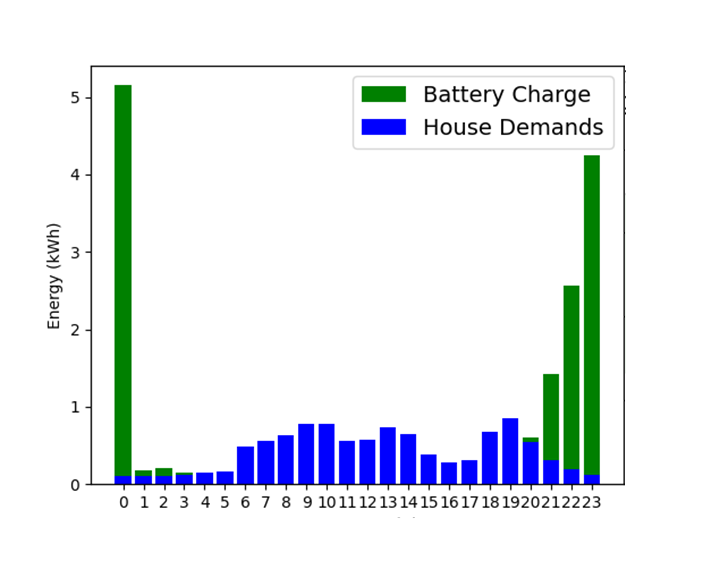
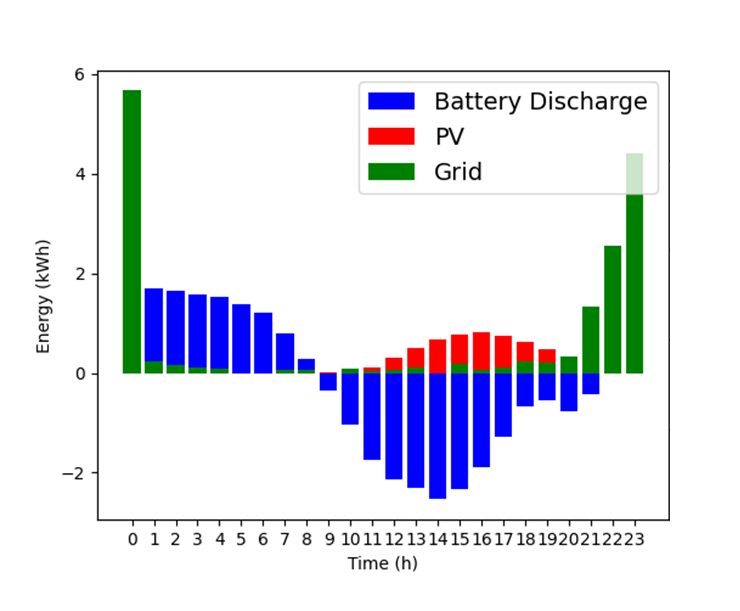

# HEM-DeepRL-v2 — Home Energy Management with Deep Reinforcement Learning

A Deep Reinforcement Learning framework for optimizing residential energy management. The agent learns to minimize electricity costs by intelligently scheduling battery charging from solar panels (PV) and the smart grid (SG), while ensuring the electric vehicle (EV) is always ready for daily use.

---

## Table of Contents

- [Overview](#overview)
- [Project Structure](#project-structure)
- [Environment](#environment)
- [Algorithms](#algorithms)
- [Installation](#installation)
- [Usage](#usage)
- [Results](#results)
- [License](#license)

---

## Overview

This project models a smart home equipped with:

- A **home battery** (100 kWh capacity)
- An **electric vehicle battery** (100 kWh capacity, 11 kWh daily consumption)
- A **photovoltaic (PV) solar panel** system
- A connection to the **smart grid (SG)**

A Deep RL agent is trained using **Proximal Policy Optimization (PPO)** to decide, at each hour, whether to charge the home or EV battery from either PV or the grid — or take no action. The goal is to **minimize the total annual electricity cost** while meeting household demand and keeping the EV charged.

---

## Project Structure

```
HEM-DeepRL-v2/
├── main.py                  # Entry point: training, testing, and plotting
├── algos/
│   ├── mcPPO.py             # Monte Carlo PPO (Actor-Critic)
│   └── DQN.py               # Double DQN with experience replay
├── pycode/
│   ├── smart_home.py        # Gym-style smart home environment
│   ├── constant.py          # Action definitions and system specifications
│   ├── processed_data.py    # Data access layer for PV, prices, and consumption
│   ├── plotter.py           # Visualization utilities
│   └── train_dqn.py         # DQN training script
├── data/
│   ├── H4.csv               # Household power consumption (minute-level)
│   ├── PV.csv               # Photovoltaic production data
│   └── Prices.csv           # Smart grid electricity prices
├── trained_models/
│   └── neural_network_trained.h5   # Pre-trained PPO model
├── generated/               # Reward logs from training runs
└── results/                 # Output plots
```

---

## Environment

The smart home environment follows the **OpenAI Gym** interface.

### State Space (5 dimensions, normalized to [0, 1])

| Feature             | Description                        |
|---------------------|------------------------------------|
| `month`             | Current month of the year          |
| `day`               | Current day of the month           |
| `time`              | Current hour of the day            |
| `home_battery`      | Home battery state of charge       |
| `ev_battery`        | EV battery state of charge         |

### Action Space (5 discrete actions)

| Action | Description                          |
|--------|--------------------------------------|
| 0      | No action                            |
| 1      | Charge home battery from PV          |
| 2      | Charge home battery from smart grid  |
| 3      | Charge EV battery from PV            |
| 4      | Charge EV battery from smart grid    |

### Reward Design

- **Primary**: Negative electricity cost (in euros) for the current time step
- **Penalty (-10)**: EV not sufficiently charged by 6:00 AM
- **Penalty (-10)**: Attempting to charge the EV during work hours (6:00–18:00)

### Episode

Each episode spans **720 time steps** (24 hours x 30 days), starting from a random date and battery state.

---

## Algorithms

### Proximal Policy Optimization (PPO)
- **Actor-Critic** architecture with two 64-unit hidden layers
- Supports both **discrete** and **continuous** action spaces
- Clipped surrogate objective (clip value = 0.2)
- Discount factor (gamma) = 0.99
- Network updates every 5 episodes

### Double DQN
- Two 64-unit hidden layers with **soft target updates** (tau = 0.005)
- Experience replay buffer (size = 2000)
- Epsilon-greedy exploration with decay (0.995)
- Discount factor (gamma) = 0.95

---

## Installation

### Prerequisites

- Python 3.8+
- pip

### Setup

1. **Clone the repository**:
   ```bash
   git clone https://github.com/wa7med/HEM-DeepRL-v2.git
   cd HEM-DeepRL-v2
   ```

2. **Install dependencies**:
   ```bash
   pip install tensorflow numpy pandas matplotlib gym
   ```

---

## Usage

All commands should be run from the project root directory.

### Train a New Model

```bash
python main.py -train_model <number_of_episodes>
```

> 300 episodes is typically sufficient for convergence.

**Example:**
```bash
python main.py -train_model 300
```

The trained model will be saved to `trained_models/neural_network_trained.h5`.

### Test a Trained Model

```bash
python main.py -test_model
```

A pre-trained model is included in the `trained_models/` directory.

### Plot Results

```bash
python main.py -plot_graph <graph_type>
```

Available graph types: `money_spent`, `battery_charge`, `reward_function`, `demands`, `generation`

---

## Results

### Money Spent (Trained vs. Random)

Comparison of monthly electricity costs between the trained PPO agent (**171.79 EUR/year**) and a random policy (**1141.75 EUR/year**) — an **85% cost reduction**.

```bash
python main.py -plot_graph money_spent
```



### Battery Charging Strategy

The agent learns to charge from the grid during **off-peak hours** (midnight, late evening) and leverage **PV during daytime** — aligning charging with low prices.

```bash
python main.py -plot_graph battery_charge
```



### Reward Function Convergence

The PPO agent converges within approximately **150 episodes**, with the reward stabilizing near zero (minimal cost).

```bash
python main.py -plot_graph reward_function
```



### House Demands vs. Battery Charge

Hourly household energy demand overlaid with battery charging activity.

```bash
python main.py -plot_graph demands
```



### Energy Generation Sources

Breakdown of energy supply by source: battery discharge, PV generation, and grid imports.

```bash
python main.py -plot_graph generation
```



---

## License

This project is developed as part of a Master's thesis research.
